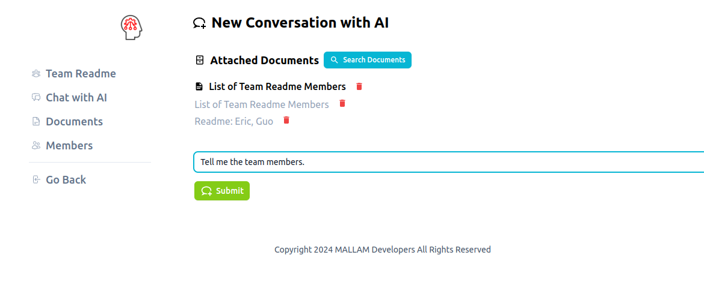

# **Ma**rxist **L**arge **La**nguage **M**odel

Mallam can be accessed through the app’s website [mallam.ai](https://mallam.ai/). Developers can sign into Mallam using their GitHub account. Mallam's datasets are available on Mallam's Hugging Faces [page](https://huggingface.co/mallam-ai).

## What Mallam does.

> "*Minds are simply what brains do.*" - [Marvin Minsky](https://www.leaderu.com/truth/2truth03.html)

Mallam is a virtual union organiser. Mallam is currently in alpha so its features are limited. Currently, Mallam supports document creation and document querying on Mallam's website [mallam.ai](https://mallam.ai/). 

## How to install Mallam:

Installation instructions, additional documentation, and technical readmes can be found on the Mallam Organisation's [GitHub](https://github.com/mallam-ai). Change logs are also available on the GitHub repository. 

### User Guide:

Navigate to the Mallam website. Log into Mallam using your GitHub account. You can now create a team, edit a team, or join an existing team. 

To create a team, first select a team name. 

You new team will need new members. Add members or viewers to your team using their ID. 

You can create, edit, and upload documents to Mallam and then ask Mallam about the contents of the documents. For example, I created a document called, "List of Team Readme Members." I then asked Mallam for the members of team Readme. 

## License Information

MIT License

Copyright © 2024 MALLAM Developers

Permission is hereby granted, free of charge, to any person obtaining a copy
of this software and associated documentation files (the "Software"), to deal
in the Software without restriction, including without limitation the rights
to use, copy, modify, merge, publish, distribute, sublicense, and/or sell
copies of the Software, and to permit persons to whom the Software is
furnished to do so, subject to the following conditions:

The above copyright notice and this permission notice shall be included in all
copies or substantial portions of the Software.

THE SOFTWARE IS PROVIDED "AS IS", WITHOUT WARRANTY OF ANY KIND, EXPRESS OR
IMPLIED, INCLUDING BUT NOT LIMITED TO THE WARRANTIES OF MERCHANTABILITY,
FITNESS FOR A PARTICULAR PURPOSE AND NONINFRINGEMENT. IN NO EVENT SHALL THE
AUTHORS OR COPYRIGHT HOLDERS BE LIABLE FOR ANY CLAIM, DAMAGES OR OTHER
LIABILITY, WHETHER IN AN ACTION OF CONTRACT, TORT OR OTHERWISE, ARISING FROM,
OUT OF OR IN CONNECTION WITH THE SOFTWARE OR THE USE OR OTHER DEALINGS IN THE
SOFTWARE.

## The Mallam Development Team

Yankee Guo is Mallam's chief technical officer. He is a Shenzhen based devops engineer. If you want to add a feature to Mallam, you can contact Yankee Guo through his [website](https://guoyk.xyz/). Terms of payment for each feature can be negotiated on his [Patreon](https://www.patreon.com/yankeguo/posts). 

Eric MacEachern is the project manager for Mallam. He is a unionised apprentice plumber in Victoria, Canada. The best way to contact Eric MacEachern is through his [LinkedIn](https://www.linkedin.com/in/eric-maceachern-059526a9/). 

